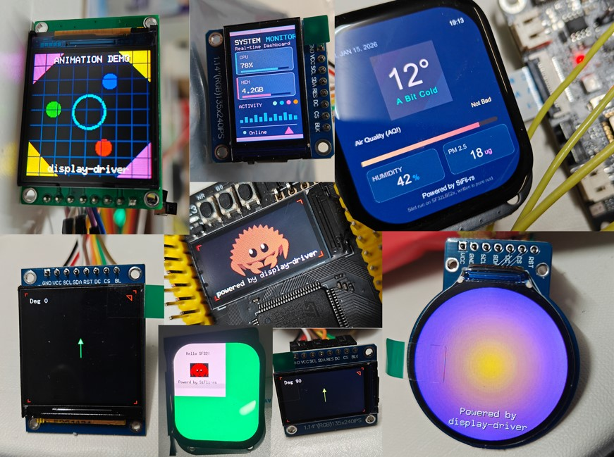

# Examples

## STM32H7B0 Examples

| example bins                                                 | Spec                                   | Graphics                          | Description                                    |
| ------------------------------------------------------------ | -------------------------------------- | --------------------------------- | ---------------------------------------------- |
| [st7735-160x80-eg-ferris](./stm32h7b0/src/bin/st7735-160x80-eg-ferris.rs) | XX096T_IF09   (Generic80_160_Type3) | embedded-graphics FrameBuffer | Draw a Ferris picture.                         |
| [st7735-160x80-rotation](./stm32h7b0/src/bin/st7735-160x80-rotation.rs) | XX096T_IF09  (Generic80_160_Type3) | embedded-graphics FrameBuffer | Rotate in four directions to check for offset. |
| [st7735-128x128-rotation](./stm32h7b0/src/bin/st7735-128x128-rotation.rs) | P144H008_V2 (Generic128_128_Type1) | embedded-graphics FrameBuffer | Rotate in four directions to check for offset. |
| [st7735-128x128-eg-animation](./stm32h7b0/src/bin/st7735-128x128-eg-animation.rs) | P144H008_V2 (Generic128_128_Type1) | embedded-graphics FrameBuffer | Creative animation demo with FPS control at 30 FPS. |
| [st7789-135x240-rotation](./stm32h7b0/src/bin/st7789-135x240-rotation.rs) | GMT114_02 (Generic135_240_Type1) | embedded-graphics FrameBuffer | Rotate in four directions to check for offset. |
| [st7789-135x240-monitor](./stm32h7b0/src/bin/st7789-135x240-monitor.rs) | GMT114_02 (Generic135_240_Type1) | embedded-graphics FrameBuffer | Computer Monitor UI Demo with modern dark theme. |
| [st7789-240x240-rotation](./stm32h7b0/src/bin/st7789-240x240-rotation.rs) | TB154 | embedded-graphics FrameBuffer | Rotate in four directions to check for offset. |
| [gc9a01-240x240-concentric](./stm32h7b0/src/bin/gc9a01-240x240-concentric.rs) | Generic240x240Type1 | embedded-graphics FrameBuffer Dithering | Concentric gradient demo with ordered dithering for GC9A01. |

