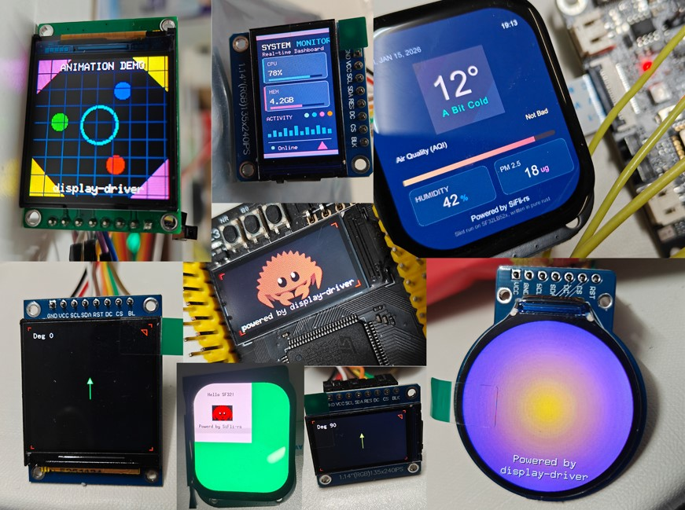

# Examples

## STM32H7B0 Examples

| example bins                                                 | Interface | Driver Method | Spec                                   | Graphics                          | Description                                    |
| ------------------------------------------------------------ | :--- | :--- | -------------------------------------- | --------------------------------- | ---------------------------------------------- |
| [st7735-160x80-eg-ferris](./stm32h7b0/src/bin/st7735-160x80-eg-ferris.rs) | SPI | Framebuffer | XX096T_IF09   (Generic80x160Type3) | embedded-graphics | Draw a Ferris picture.                         |
| [st7735-160x80-rotation](./stm32h7b0/src/bin/st7735-160x80-rotation.rs) | SPI | Framebuffer | XX096T_IF09  (Generic80x160Type3) | embedded-graphics | Rotate in four directions to check for offset. |
| [st7735-128x128-rotation](./stm32h7b0/src/bin/st7735-128x128-rotation.rs) | SPI | Framebuffer | P144H008_V2 (Generic128x128Type1) | embedded-graphics | Rotate in four directions to check for offset. |
| [st7735-128x128-eg-animation](./stm32h7b0/src/bin/st7735-128x128-eg-animation.rs) | SPI | Framebuffer | P144H008_V2 (Generic128x128Type1) | embedded-graphics | Creative animation demo with FPS control at 30 FPS. |
| [st7789-135x240-rotation](./stm32h7b0/src/bin/st7789-135x240-rotation.rs) | SPI | Framebuffer | GMT114_02 (Generic135x240Type1) | embedded-graphics | Rotate in four directions to check for offset. |
| [st7789-135x240-monitor](./stm32h7b0/src/bin/st7789-135x240-monitor.rs) | SPI | Framebuffer | GMT114_02 (Generic135x240Type1) | embedded-graphics | Computer Monitor UI Demo with modern dark theme. |
| [st7789-240x240-rotation](./stm32h7b0/src/bin/st7789-240x240-rotation.rs) | SPI | Framebuffer | TB154 (Generic240x240Type1) | embedded-graphics | Rotate in four directions to check for offset. |
| [st7789-240x320-cat-jpg](./stm32h7b0/src/bin/st7789-240x320-cat-jpg.rs) | SPI | Framebuffer | Generic240x320Type1 | tjpgd-rs | Decode and display a JPEG image of a cat. |
| [st7789-240x320-eg-ferris](./stm32h7b0/src/bin/st7789-240x320-eg-ferris.rs) | SPI | Framebuffer | Generic240x320Type1 | embedded-graphics | Draw a Ferris picture. |
| [gc9a01-240x240-concentric](./stm32h7b0/src/bin/gc9a01-240x240-concentric.rs) | SPI | Framebuffer | Generic240x240Type1 | embedded-graphics Dithering | Concentric gradient demo with ordered dithering for GC9A01. |
| [gc9a01-240x240-cat-rotate](./stm32h7b0/src/bin/gc9a01-240x240-cat-rotate.rs) | SPI | Framebuffer | Generic240x240Type1 | embedded-graphics tjpgd-rs | Rotate a JPEG image on the display. |

## STM32H7B0 QSPI Examples

| example bins | Interface | Driver Method | Spec | Graphics | Description |
| :--- | :--- | :--- | :--- | :--- | :--- |
| [st77916-360x360-qspi-jpg](./stm32h7b0_qspi/src/bin/st77916-360x360-qspi-jpg.rs) | QSPI | Framebuffer | NT150XV | tjpgd-rs | Decode and display JPEG on ST77916 QSPI display using Async OSPI with MDMA. |

## RP2040 Examples

| example bins | Interface | Driver Method | Spec | Graphics | Description |
| :--- | :--- | :--- | :--- | :--- | :--- |
| [gc9a01-240x240-concentric](./rp2040/src/bin/gc9a01-240x240-concentric.rs) | SPI | Framebuffer | Generic240x240Type1 | embedded-graphics Dithering | Concentric gradient demo with ordered dithering for GC9A01. |
| [st7735-128x128-eg-animation](./rp2040/src/bin/st7735-128x128-eg-animation.rs) | SPI | Framebuffer | Generic128x128Type1 | embedded-graphics | Creative animation demo with FPS control at 30 FPS. |
| [st7735-160x80-eg-ferris](./rp2040/src/bin/st7735-160x80-eg-ferris.rs) | SPI | Framebuffer | Generic80x160Type2 | embedded-graphics | Draw a Ferris picture. |
| [st7789-240x240-ferris-jpg](./rp2040/src/bin/st7789-240x240-ferris-jpg.rs) | SPI | Framebuffer | Generic240x240Type1 | embedded-graphics tjpgd-rs | Decode and display a JPEG image of Ferris. |
| [st7789-240x240-rotation](./rp2040/src/bin/st7789-240x240-rotation.rs) | SPI | Framebuffer | Generic240x240Type1 | embedded-graphics | Rotate in four directions to check for offset. |

## ESP32-S3 Examples

| example bins | Interface | Driver Method | Spec | Graphics | Description |
| :--- | :--- | :--- | :--- | :--- | :--- |
| [co5300-240x240-qspi-eg](./esp32s3/src/bin/co5300-240x240-qspi-eg.rs) | QSPI | Framebuffer | GenericCo5300 | embedded-graphics | CO5300 AMOLED QSPI display demo with embedded-graphics. |
| [co5300-390x450-qspi-eg-partial-fb](./esp32s3/src/bin/co5300-390x450-qspi-eg-partial-fb.rs) | QSPI | Partial Framebuffer | Amoled_185Inch_390x450 | embedded-graphics | CO5300 AMOLED QSPI display using a partial framebuffer to save RAM. |
| [st77916-360x360-qspi-eg](./esp32s3/src/bin/st77916-360x360-qspi-eg.rs) | QSPI | Framebuffer | NT150XV | embedded-graphics | ST77916 QSPI round display demo with embedded-graphics. |
| [st77916-360x360-qspi-jpg](./esp32s3/src/bin/st77916-360x360-qspi-jpg.rs) | QSPI | Framebuffer | NT150XV | tjpgd-rs | Decode and display a JPEG image of a cat. |

## CH32V305 Examples

| [st7789p3-240x320-eg-ferris](./ch32v305/src/bin/st7789p3-240x320-eg-ferris.rs) | SPI | Partial Framebuffer | Generic240x320P3Type1 | Draw a Ferris picture |

## External Examples

CO5300 AMOLED display driver example for SF32LB52x LCDC hardware: 
https://github.com/OpenSiFli/sifli-rs/blob/main/examples/sf32lb52x/src/bin/lcdc_eg_co5300.rs

Slint UI example for the SF32LB52x platform:
https://github.com/decaday/sf32-slint-example
