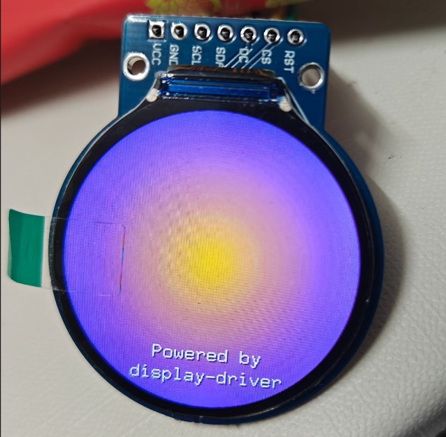

# GC9A01 Display Driver

This crate provides an async driver for the GC9A01 display controller, implementing the `Panel` trait to be used with the [display-driver](https://github.com/decaday/display-driver) crate.

This driver is commonly used for round LCD displays (often 240x240).



## Usage

This driver is designed to work with the [display-driver crate](https://github.com/decaday/display-driver). You can use the `DisplayDriver` struct to drive the display.

### 1. Choose a Spec
The GC9A01 panels typically come in 240x240 resolution, but 128x128 variants also exist. This crate provides `Generic` types that map to these common variations.

### 2. Implementation Example

```rust
use display_driver::{ColorFormat, DisplayDriver, Orientation, LCDResetOption};
use display_driver_gc9a01::{Gc9a01, spec::{Generic240x240Type1}};

// 1. Configure Reset
let reset_opt = LCDResetOption::new_pin(reset_pin);

// 2. Create the Panel instance using a Generic Spec
let panel = Gc9a01::<Generic240x240Type1, _, _>::new(reset_opt);

// 3. Bind Bus and Panel, Configure, and Initialize
// The driver orchestrates the logic, delegating transport to 'bus' and commands to 'panel'.
let mut display = DisplayDriver::builder(bus, panel)
    .with_color_format(ColorFormat::RGB565)
    // This framework automatically handles offsets.
    .with_orientation(Orientation::Deg0)
    .init(&mut delay).await.unwrap();

// Now you can use `display` to draw:
display.write_frame(fb).await.unwrap();
```

Full examples can be found at [examples](../../examples/README.md)

## Specs

We use a `Spec` trait to handle resolution and offset differences.
- **Generic Specs**: Pre-defined configurations for common panel variations (found in `spec`).

| Generic Type | Resolution | Description |
| :--- | :--- | :--- |
| `Generic240x240Type1` | 240x240 | Common round display |
| `Generic128x128Type1` | 128x128 | Smaller variant |

### Implementing a Custom Spec

If the built-in Generic specs don't match your display, you can define your own by implementing the `Gc9a01Spec` trait.

```rust
use display_driver_gc9a01::{PanelSpec, Gc9a01Spec};

// 1. Define your type
pub struct MyCustomPanel;

// 2. Configure Resolution & Offsets
impl PanelSpec for MyCustomPanel {
    const PHYSICAL_WIDTH: u16 = 240;
    const PHYSICAL_HEIGHT: u16 = 240;

    // Panel Offset
    const PHYSICAL_X_OFFSET: u16 = 0;
    const PHYSICAL_Y_OFFSET: u16 = 0;

    // Set true if Red and Blue are swapped (BGR Order)
    const BGR: bool = true; 

    // For other optional settings, please refer to the code comments.
}

// 3. Implement Gc9a01Spec marker trait
impl Gc9a01Spec for MyCustomPanel {}
```

## License

This project is under Apache License, Version 2.0 ([LICENSE](../../LICENSE) or <http://www.apache.org/licenses/LICENSE-2.0>).
