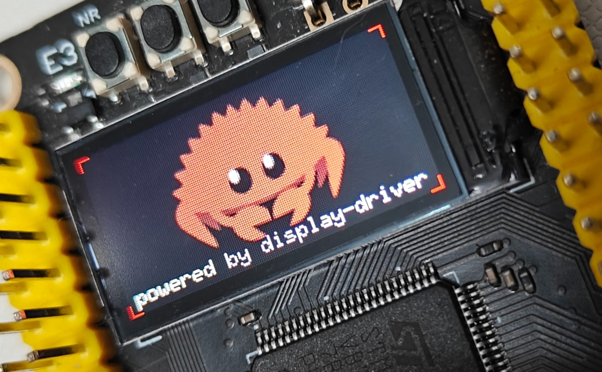

# ST7735 Display Driver

This crate provides an async driver for the ST7735 display controller, implementing the `Panel` trait to be used with the `display-driver` crate.



## Usage

This driver is intended to be used as a `Panel` implementation within the [display-driver crate](https://github.com/decaday/display-driver).

### 1. Choose a Spec
The ST7735 has many variations (often distinguished by "Tab" colors in other libraries). This crate provides `Generic` types that map to these common variations.

### 2. Implementation Example

```rust
use display_driver::{ColorFormat, DisplayDriver, Orientation, LCDResetOption};
use dd_st7735::{St7735, 

// The `Spec` (Generic128_160Type1) defines the hardware-specific constants (Gamma, Voltage) typesafe-ly.
spec::generic::Generic128_160Type1};

// 1. Configure Reset
let reset_opt = LCDResetOption::new_pin(reset_pin);

// 2. Create the Panel instance using a Generic Spec (e.g., Generic128_160Type1)
let panel = St7735::<Generic128_160Type1, _, _>::new(reset_opt);

// 3. Bind Bus and Panel
// The driver orchestrates the logic, delegating transport to 'bus' and commands to 'panel'.
let mut display = DisplayDriver::new(bus, panel);

// 4. Async Initialization
display.init(&mut delay).await.unwrap();
display.set_color_format(ColorFormat::RGB565).await.unwrap();
// This framework automatically handles offsets.
display.set_orientation(Orientation::Deg90).await.unwrap();

// Now you can use `display` to draw:
display.write_frame(fb).await.unwrap();
```

Full examples can be found at [examples](../../examples/README.md)

## Specs

Because ST7735 panels come in various resolutions, offsets, and color formats, we use a `Spec` trait.
- **Generic Specs**: Pre-defined configurations for common panel variations (found in `spec::generic`).
- **Vendor Specs**: Specific implementations for known physical display modules (found in `spec::vendor_specs`).

You can also define your own Spec by implementing the `St7735Spec` trait if your panel has unique requirements.

### Mapping Table

The following table maps the provided `Generic` types to common names used in the Adafruit and TFT_eSPI libraries, as well as specific vendor implementations present in this crate.

| Generic Type | Adafruit Name | TFT_eSPI Name | Vendor Specs |
| :--- | :--- | :--- | :--- |
| `Generic128_160Type1` | RedTab | RedTab | - |
| `Generic128_160Type2` | BLACKTAB | BLACKTAB | - |
| `Generic128_160Type3` | GREENTAB | GREENTAB | `CL177SPI` (1.77") |
| `Generic128_160Type4` | - | GREENTAB2 | - |
| `Generic128_160Type5` | - | GREENTAB3 | - |
| `Generic80_160_Type1` | MINI160x80 | - | - |
| `Generic80_160_Type2` | - | REDTAB160x80 | - |
| `Generic80_160_Type3` | MINI160x80PLUGIN | GREENTAB160x80 | `XX096T_IF09` (0.96") |
| `Generic128_128_Type1` | 144GREENTAB / HALLOWING | - | - |
| `Generic128_128_Type2` | - | GREENTAB128 | `P144H008_V2` (1.44") |

### Implementing a Custom Spec

If the built-in Generic or Vendor specs don't match your display (e.g., incorrect offsets, colors inverted, different Gamma curve), you can define your own.

> [!TIP]
> You can use the `impl_st7735_initr!` macro to use standard "InitR" values (common parameters from Adafruit_ST7735) for the complex registers.

```rust
use dd_st7735::{MipidcsSpec, St7735Spec, impl_st7735_initr};

// 1. Define your type
pub struct MyCustomPanel;

// 2. Configure Resolution & Offsets
impl MipidcsSpec for MyCustomPanel {
    const PHYSICAL_WIDTH: u16 = 128;
    const PHYSICAL_HEIGHT: u16 = 160;

    // Panel Offset
    const PHYSICAL_X_OFFSET: u16 = 2;
    const PHYSICAL_Y_OFFSET: u16 = 1;

    // Optional Panel offset in pixels when the screen is rotated 180° or 270°.
    // Used for panels that are not physically centered within the frame.
    // If undefined, defaults to PHYSICAL_X_OFFSET / PHYSICAL_Y_OFFSET.
    const PHYSICAL_X_OFFSET_ROTATED: u16 = 2;
    const PHYSICAL_Y_OFFSET_ROTATED: u16 = 3;

    // Set true if colors are inverted (White is Black)
    const INVERTED: bool = true; 
    // Set true if Red and Blue are swapped (BGR Order)
    const BGR: bool = true; 
}

// 3. Implement St7735Spec
// Option A: Use default "InitR" sequence (Easiest)
impl_st7735_initr!(MyCustomPanel);

// Option B: manual implementation (Advanced)
// Include Gamma, Power, Frame Rate etc.
// impl St7735Spec for MyCustomPanel {
//      ... define const FRMCTR1_PARAMS, etc.
// }
```

## License

This project is under Apache License, Version 2.0 ([LICENSE](../../LICENSE) or <http://www.apache.org/licenses/LICENSE-2.0>).
